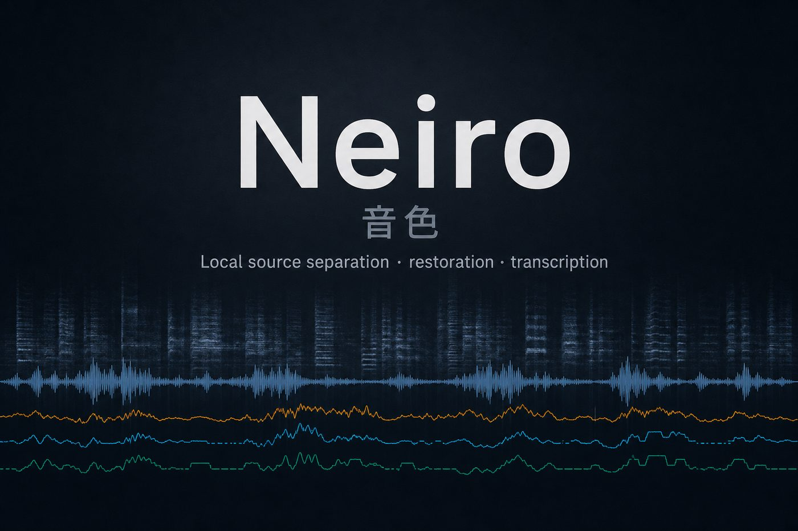
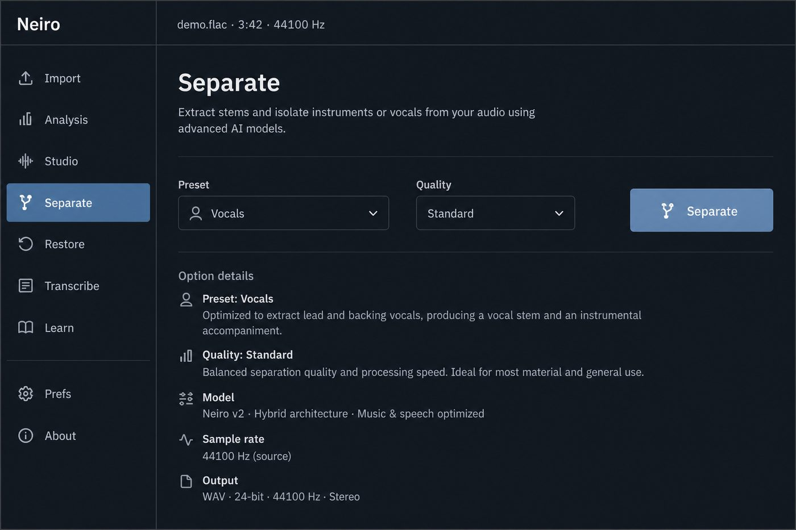
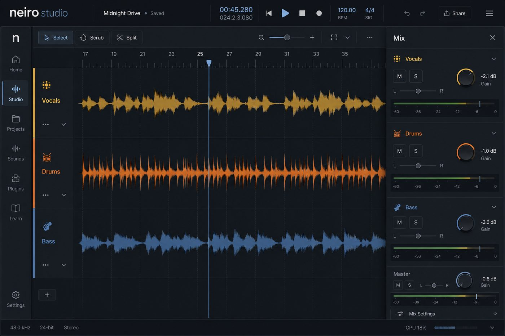
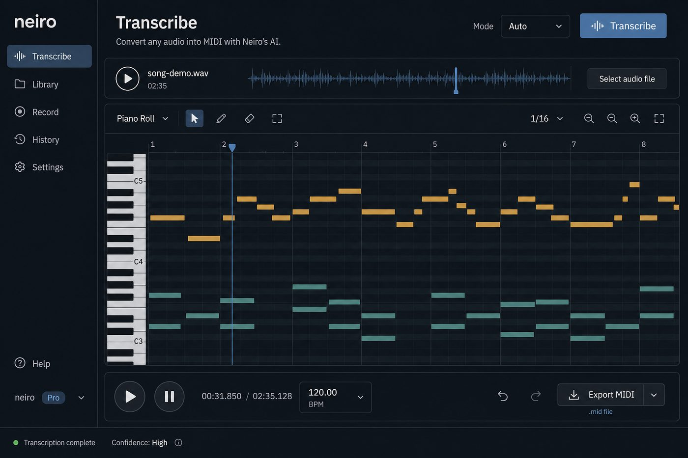

<p align="center">
  
</p>

<p align="center">
  <strong>Local source separation, restoration, transcription, and audio editing.</strong><br/>
  <em>Neiro</em> (音色) means <strong>timbre</strong> — the color of a sound.<br/>
  Everything runs on your machine. Audio never leaves it.
</p>

<p align="center">
  <a href="https://github.com/ericcayers-ai/Neiro/actions/workflows/ci.yml"></a>
  <a href="https://www.python.org/"></a>
  <a href="LICENSE"></a>
  <a href="https://github.com/ericcayers-ai/Neiro/releases"></a>
</p>

---

## At a glance

| | |
|:---|:---|
| **Separate** | Vocals, karaoke, harmonic/percussive, 4/6-stem, drums — ensembles + null-test residual |
| **Restore** | Declip, dehum, denoise, dereverb, super-res, mastering — auto chains from analysis |
| **Transcribe** | Audio → MIDI (YIN floor; Basic Pitch / piano when installed) + MusicXML / tab / lyrics |
| **Studio** | Waveform + spectrogram edits, Mix drawer, Learn practice, DAW injector capture |
| **Privacy** | Binds to `127.0.0.1` only. Pure-DSP floor works with **no model downloads**. |

<p align="center">
  
</p>

---

## The worksuite

One engine, two doors: **Tauri desktop** or **`neiro ui` in the browser**. Same modules, same jobs, same local cache.

<p align="center">
  
  <br/><sub>Separate — labeled presets, quality tiers, honest stage progress</sub>
</p>

<p align="center">
  
  <br/><sub>Studio — multi-track timeline, Mix drawer, non-destructive edits</sub>
</p>

<p align="center">
  
  <br/><sub>Transcribe — piano roll, MIDI / MusicXML, Practice panel</sub>
</p>

**Keyboard** — modules `1`–`6` / `8`–`9`, Mix `7`, command palette `Ctrl/⌘K`, collapse rail `Ctrl/⌘B`.

---

## Quick start

### Desktop

Grab a [release](https://github.com/ericcayers-ai/Neiro/releases) and use the one-click launcher in `packaging/launchers/` (`Neiro UI.bat` / `neiro-ui.sh`), or run from source:

```bash
npm install && npm run tauri:dev
```

### CLI / Python

```bash
pip install -e .
# optional backends:
pip install -e ".[all]"          # separation, piano, restoration, loudness, HF hub, yt-dlp
pip install -e ".[demucs]"       # HTDemucs 4-stem
pip install -e ".[basicpitch]"   # Spotify Basic Pitch — Python ≤3.11
pip install -e ".[superres]"     # AudioSR — Python ≤3.11
pip install -e ".[youtube]"      # URL ingest (yt-dlp)
pip install -e ".[dev]"          # tests + linting
```

Requires **Python 3.10–3.12** and [ffmpeg](https://ffmpeg.org) on `PATH` for compressed/video inputs (WAV/FLAC work without it).  
`[all]` omits `basicpitch` / `superres` so Python 3.12 installs stay clean — add those on 3.10/3.11.

<p align="center">
  
</p>

```bash
neiro ui                                   # local interface (browser or desktop shell)

neiro ingest "https://youtu.be/…"          # cache audio locally (needs [youtube])
neiro analyze song.flac                    # tempo, key, loudness, conditions (JSON)

neiro separate song.flac --preset vocals
neiro separate song.wav  --preset vocals-ensemble
neiro separate song.wav  --preset 4stem             # HTDemucs when installed

neiro enhance old.wav                      # auto-repair from analysis
neiro enhance vox.wav --chain dehum,denoise,normalize

neiro transcribe song.wav --out song.mid
neiro transcribe solo.wav --mode direct --no-quantize

neiro models
neiro download <model-id>
neiro watch ./inbox --out ./done --job separate --preset vocals
```

Transcription also writes MusicXML, ASCII tab, and LRC lyrics beside MIDI. MuseScore / Verovio on `PATH` upgrades score export to engraved PDF/SVG — see [`src/neiro/symbolic/`](src/neiro/symbolic/).

---

## How it works

<p align="center">
  
</p>

```
ingest → lane(sr) → analyze
                 ├→ separate(model / ensemble) → {stems…} → residual (null test)
                 ├→ enhance(chain) → restored audio
                 └→ [split] → transcribe(model) → compile → Timeline → MIDI
```

- **Typed artifacts** flow through a **DAG**, keyed in a **content-addressed cache** — re-runs recompute only what changed.
- **The Planner** turns intent + analysis + hardware into a concrete graph. CLI, desktop, and browser are thin clients.
- **VRAM manager** applies a downgrade ladder (evict → fp16 → shrink chunk → CPU) so CUDA OOM never surfaces raw.
- **Models are manifests**, not hard deps — core is numpy/scipy; neural backends plug in via JSON.

Deep dive: [`docs/architecture.md`](docs/architecture.md).

---

## Features (detail)

<details>
<summary><strong>Separate</strong> — stems, ensembles, null test</summary>

Vocals/instrumental, harmonic/percussive, karaoke, 4/6-stem, drum-kit decomposition. Weighted spectral-fusion **ensemble** + test-time augmentation. Every result includes a **null-test residual** so you can hear what was left behind.
</details>

<details>
<summary><strong>Restore</strong> — repair chains</summary>

Declip, mains-hum removal, spectral-gate denoise, dereverb, AudioSR bandwidth extension, Matchering reference mastering — automatic **conditioning chains** from analysis, or explicit chains on demand.
</details>

<details>
<summary><strong>Transcribe</strong> — audio → MIDI</summary>

Dependency-free YIN for the model-free floor; Basic Pitch and piano (with pedal) when installed. Timeline compiler does **reversible** groove-preserving quantization (grid for notation, micro-offsets for feel) and auto-splits dense mixes before decoding.
</details>

<details>
<summary><strong>Analyze · Edit · Learn · DAW</strong></summary>

- **Analyze** — loudness, tempo, key, clipping, bandwidth, effective-mono, hum/echo, instrument hints  
- **Studio** — trim / silence / fade / gain / normalize / reverse with non-destructive undo  
- **Learn** — loop regions, count-in, metronome, step / WebMIDI / DAW wait mode  
- **DAW** — shared-window VST2 / CLAP injectors, Edison-style capture into the same UI  
</details>

---

## Documentation

| Doc | What it covers |
|---|---|
| [Architecture](docs/architecture.md) | Engine + desktop shell |
| [UI](docs/ui.md) | Modules, design language, shortcuts |
| [Models](docs/models.md) | Manifests, licenses, fetching weights |
| [Adding a model](docs/adding-models.md) | Adapters & ensembles |
| [Session](docs/session.md) | Provenance & reproducibility |
| [Plugins](docs/plugins.md) | Extension points & trust boundaries |
| [Performance](docs/performance.md) | RTF benchmarks |
| [Evaluation](docs/evaluation.md) | Quality harness |
| [Roadmap](roadmap.md) / [Traceability](docs/roadmap-traceability.md) | Vision & status |
| [Changelog](CHANGELOG.md) | Release history |

---

## Development

```bash
# Python engine
pip install -e ".[dev]"
ruff check . && ruff format --check .
pytest
python scripts/benchmark.py
python scripts/verify_models.py

# Frontend
npm --prefix frontend ci
npm --prefix frontend run lint
npm --prefix frontend run build

# Desktop shell
cd src-tauri && cargo fmt --all && cargo clippy --all-targets && cargo check
npm run tauri:dev   # from repo root
```

Contributions welcome — see [CONTRIBUTING.md](CONTRIBUTING.md). Lowest-friction path: a new model manifest + adapter ([guide](docs/adding-models.md)).

---

## Status

| Area | State |
|---|---|
| DAG runtime, cache, VRAM ladder, manifests | ✅ |
| Analysis + DSP separation / restore / YIN transcription | ✅ no downloads |
| Neural adapters (Demucs, RoFormer, Basic Pitch, AudioSR, …) | ✅ opt-in weights |
| Studio, Mixer, Learn, Preferences, session Save/Open | ✅ |
| Desktop shell (Tauri 2 + React) | ✅ |
| Watch-folder batch (`neiro watch`) | ✅ |
| DAW shared-window injector + Edison capture | ✅ |
| Symbolic export (MusicXML / tab / LRC; PDF via Verovio/MuseScore) | ✅ |
| Full MUSDB / MAESTRO eval tables | ⏳ needs user datasets |

**Neiro 1.1.1** — UI navigation QOL (command palette, collapsible rail, session dialogs) on top of the 1.1.0 DAW + model-zoo release. See [`CHANGELOG.md`](CHANGELOG.md).

---

## Licensing

Engine, desktop shell, and frontend are **MIT** ([LICENSE](LICENSE)).  
Individual **models** keep their own licenses (some non-commercial / research-only). Manifests record them; `neiro models` shows them; export metadata carries them forward.

See [docs/models.md](docs/models.md) and [SECURITY.md](SECURITY.md) for the local-first security model and weight supply-chain notes.
